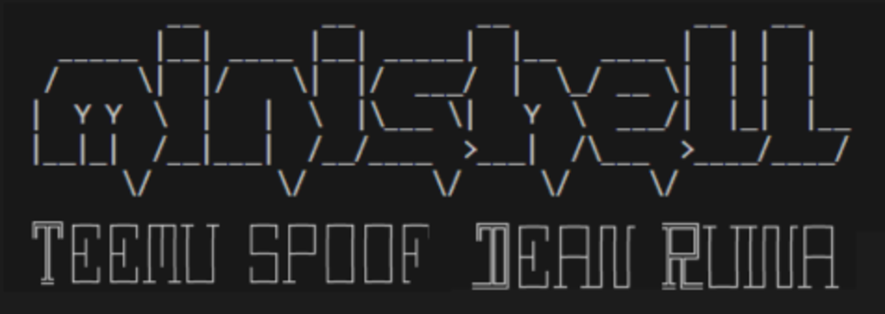
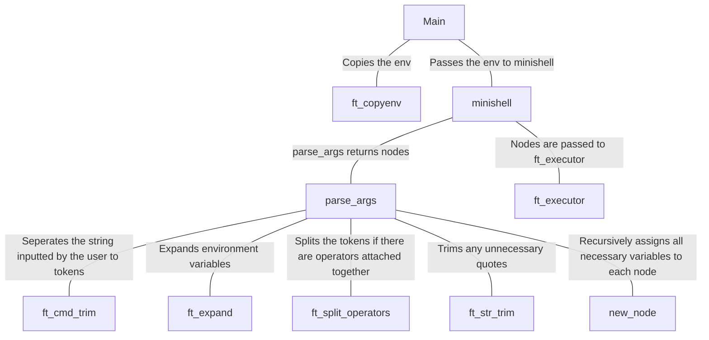

# Minishell

## Description ##

A miniature clone of bash.

## About ##

- minishell can run executables from an absolute `/bin/cat`, relative `../../../../../bin/cat`, or environment PATH `cat` with arguments.
- Environment variables are also handled including the exit status `$?`.
- You can use redirections `> >> < <<` and pipes `|`.
- Builtins: `cd`, `pwd`, `echo`, `export`, `unset`, `env`, `exit`.
- Single and double quotes work just like in bash.
- Three signals are also handled just like in bash:
- `Ctrl-C` displays a new prompt on a new line.
- `Ctrl-\` does nothing.
- `Ctrl-D` exits the shell.

## Functionality ##

- Main calls ft_env to store the environment variables into key and value pair array.
- Main has an eternal loop reading the input from the user and passing it to minishell.
- Minishell parses the arguments into nodes that will be executed by the ft_executor.
- Ft_executer forks and each node is executed in the child process.
- Parent process returns to the main and the loop continues.




## Usage ##

```bash
# Clone this project
$ git clone https://github.com/Stte/minishell

# Access
$ cd minishell

# Compile the program
$ make

# Run the project
$ ./minishell

```

## Authors

- [@DeRuina](https://github.com/DeRuina)
- [@Stte](https://github.com/Stte)
