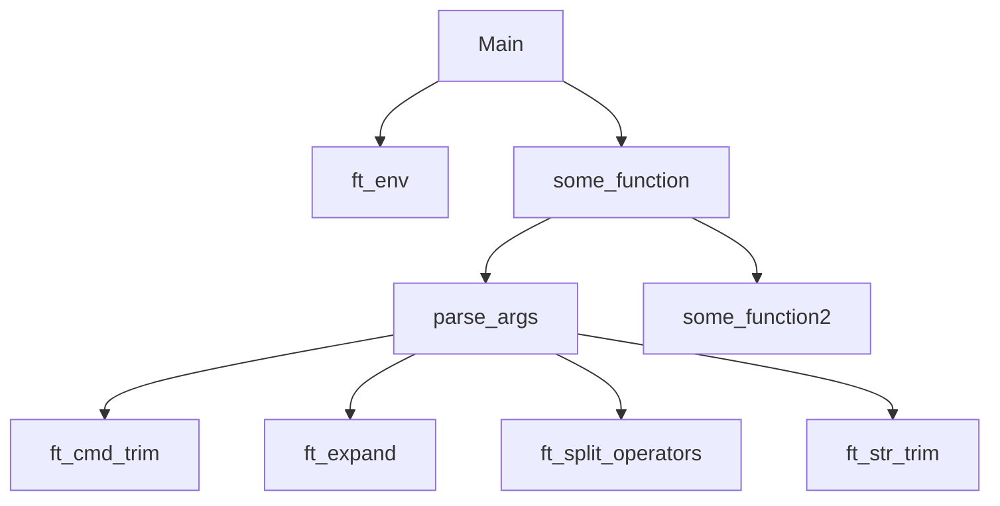

# minishell

```mermaid
flowchart TD
    A[Main] --> B[ft_env]
    A --> C[some_function]
    C --> D[parse_args]
    D --> E[ft_cmd_trim]
    D --> F[ft_expand]
    D --> G[ft_split_operators]
    D --> H[ft_str_trim]
    C --> I[some_function2]
```
