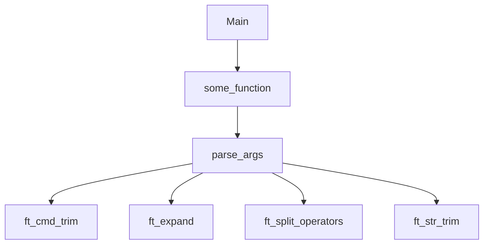

# minishell

git pull

git pull origin main

*work*
commit, push

git pull origin main
git checkout main
git pull
git merge yourbranch
git push
git checkout yourbranch
git pull origin main

```mermaid
flowchart TD
    A[Main] --> B[some_function]
    B --> C[parse_args]
    C --> D[ft_cmd_trim]
    C --> E[ft_expand]
    C --> F[ft_split_operators]
    C --> G[ft_str_trim]
```
