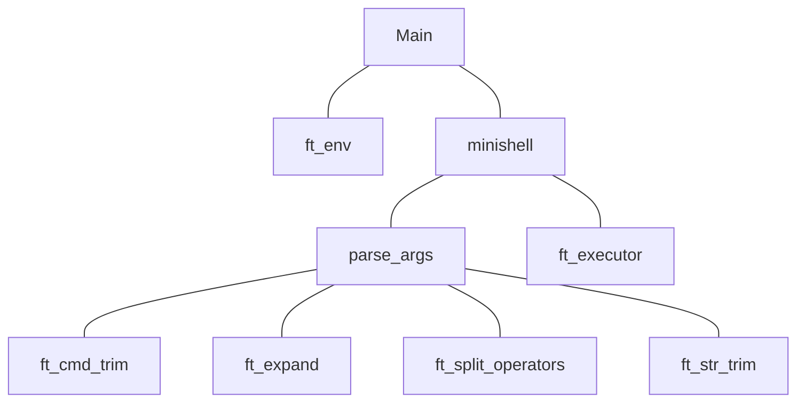

# minishell

- Main calls ft_env to store the environment variables into and key value pair array.
- Minishell parses the arguments into nodes that will be executed by the ft_executor.

```mermaid
flowchart TD
    A --- B[ft_env]
    A[Main] --- C[minishell]
    C --- D[parse_args]
    D --- E[ft_cmd_trim]
    D --- F[ft_expand]
    D --- G[ft_split_operators]
    D --- H[ft_str_trim]
    C --- I[ft_executor]
```
